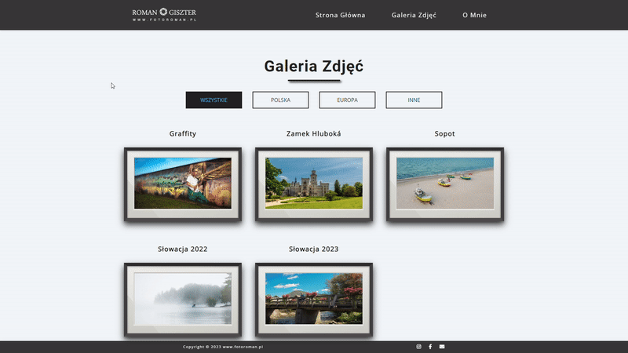
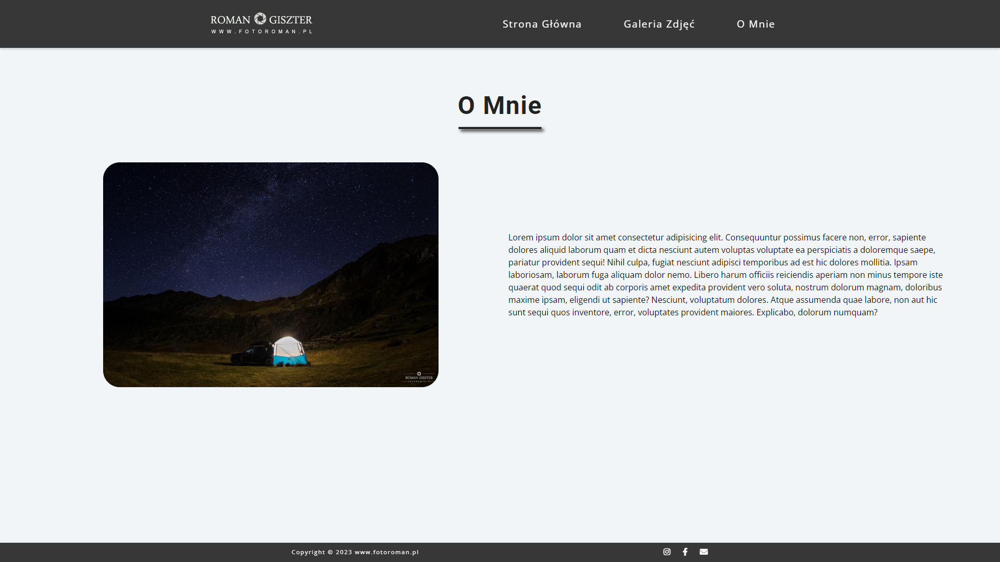
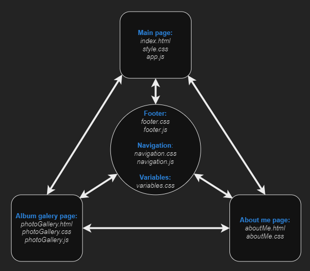

# Fotoroman - photo page

Simple page to publish and share my father photos created with HTML, CSS and JavaScript.

## Demo
Working live demo <a href="https://giszta.github.io/photopage/" target="_blank">here</a>

## Gifs & Screenshots
### Main page with randomly loaded photos and quotes

### Album gallery page with filtering buttons

### Image viewer with manual or automatic photo slideshow

### About me section

### First mobile view upgrade

## Technologies
* HTML5
* CSS3
* JavaScript

## To-do
* Create thumbnail carousel for albums with more photos;
* Full window mode for slideshow;
* Improve mobile view;
* Add shutterstock link and icon;
* Create admin panel to allow adding new albums and photos;
* Anything my father comes up with ;);
* Rewrite code to react.

## Contact

Created by <a href="https://www.linkedin.com/in/adam-giszter/" target="_blank">Adam Giszter</a> - feel free to contact me!.
